<div align="center">

# Task Manager API - An Exhaustive Guide

### A Production-Ready Foundation for RESTful Task Management using FastAPI and Modern Python Development Practices

<br>

<a href="https://github.com/AayushBadola"></a>

<br>


<a href="https://github.com/AayushBadola/TaskManager/actions/workflows/ci.yml" target="_blank" rel="noopener noreferrer"></a>

<br>

<div align="center">
  <a href="https://github.com/AayushBadola/TaskManager" target="_blank" rel="noopener noreferrer">
    
  </a>
  <a href="https://www.linkedin.com/in/aayush-badola-0a7b2b343" target="_blank" rel="noopener noreferrer">
    
  </a>
  <a href="https://mail.google.com/mail/?view=cm&fs=1&to=aayush.badola2@gmail.com" target="_blank" rel="noopener noreferrer">
    
  </a>
</div>

</div>

---

<div align="center">

### "Illustrating Best Practices in API Development with Python."

</div>

## 📖 Exhaustive Overview & Project Philosophy

Welcome to the Task Manager API project! This repository serves as a highly detailed blueprint for constructing robust, maintainable, and efficient RESTful APIs using the Python ecosystem's modern tooling. While the core functionality provides simple **CRUD (Create, Read, Update, Delete)** operations for managing tasks, the true value lies in the **architectural patterns, development practices, and integrated tooling** demonstrated throughout.

**What is a RESTful API?**
Representational State Transfer (REST) is an architectural style for designing networked applications. Key principles include:
*   **Resources:** Identifying application data as resources (e.g., `/tasks`, `/tasks/1`).
*   **Standard HTTP Methods:** Using verbs like `GET`, `POST`, `PUT`, `DELETE`.
*   **Statelessness:** Each request contains all information needed.
*   **Standard Representations:** Using formats like JSON.
This project adheres strictly to these principles.

**Technology Choices & Rationale:**
*   **Python 3.10+:** Modern features, enhanced type hinting.
*   **FastAPI:** High performance, auto validation/serialization (via Pydantic type hints), dependency injection, auto docs (Swagger/ReDoc), async support.
*   **Pydantic:** Data validation, clear schema definitions (`schemas.py`, `models.py`).
*   **Uvicorn:** High-performance ASGI server for FastAPI.
*   **Pytest:** Industry standard for Python testing (fixtures, assertions).
*   **Ruff:** Extremely fast Rust-based linter and formatter.
*   **Mypy:** Static type checker for type hint analysis.

**Core Philosophy:**
Emphasis on:
1.  **Structure & Maintainability:** Layered architecture (API, Data Access, Storage).
2.  **Readability & Consistency:** Enforced by Ruff.
3.  **Correctness & Reliability:** Validated via Pytest, Mypy, Ruff.
4.  **Developer Experience:** Auto-docs, fast feedback loops.
5.  **Testability:** Facilitated by dependency injection.
6.  **Automation:** CI/CD (GitHub Actions) for quality checks.

Consider this repository a practical guide and template for applying these principles to Python API development.

<br>
<div align="center">

```
📋 Explore this project to learn how FastAPI, Pydantic, Pytest, Ruff, and Mypy
integrate seamlessly to create a high-quality, developer-friendly API foundation.
```

</div>

## ✨ Deep Dive into Features & Design Decisions

<table>
  <tr>
    <td>✅ <b>Principled RESTful API Design</b></td>
    <td>Adheres strictly to REST principles: noun-based resources (`/tasks/`), HTTP verbs (`GET`, `POST`, `PUT`, `DELETE`), appropriate status codes (`200`, `201`, `204`, `404`, `422`).</td>
  </tr>
  <tr>
    <td>✅ <b>Type-Driven Data Validation & Serialization (Pydantic)</b></td>
    <td>Pydantic models in `schemas.py` (e.g., `TaskCreate`, `Task`) with type hints (`title: str`, `completed: bool = False`) enable FastAPI to automatically parse, validate requests, serialize responses, and document schemas.</td>
  </tr>
  <tr>
    <td>✅ <b>Full Task Lifecycle Management (CRUD)</b></td>
    <td>Implements:
        <br>- **Create:** `POST /tasks/`
        <br>- **Read:** `GET /tasks/`, `GET /tasks/{task_id}`
        <br>- **Update:** `PUT /tasks/{task_id}`
        <br>- **Delete:** `DELETE /tasks/{task_id}`
    </td>
  </tr>
    <tr>
    <td>✅ <b>Explicit Layered Architecture</b></td>
    <td>Code structured into layers:
        <br>- **Presentation/API Layer (`main.py`):** Handles HTTP, routes, request validation, calls service layer.
        <br>- **Data Access/Service Layer (`crud.py`):** Logic for data interaction, uses internal models (`models.py`).
        <br>- **Data Storage Abstraction (`database.py`):** Provides data store access (in-memory), uses dependency injection (`Depends(get_db)`).
        <br>- **Data Contracts (`schemas.py`, `models.py`):** Define API (`schemas`) and internal (`models`) data shapes.
    </td>
  </tr>
  <tr>
    <td>✅ <b>Swappable In-Memory "Database"</b></td>
    <td>A Python dictionary (`database.py:fake_db`) as a temporary data store. The `get_db` function provides the abstraction point.</td>
  </tr>
  <tr>
    <td>✅ <b>Robust Automated Testing Suite (Pytest + TestClient)</b></td>
    <td>`tests/test_main.py` covers happy paths, error cases (e.g., 404), validation (implicit 422 checks). Pytest fixtures (`client`) ensure test isolation by resetting the database. FastAPI's `TestClient` makes direct requests to the app.</td>
  </tr>
   <tr>
    <td>✅ <b>Blazing Fast Linting & Formatting (Ruff)</b></td>
    <td>`Ruff` configured in `pyproject.toml` enforces consistent code style (like `black`, `isort`) and detects bugs/anti-patterns (like `flake8`).</td>
  </tr>
   <tr>
    <td>✅ <b>Static Type Safety (Mypy)</b></td>
    <td>Configured in `pyproject.toml`, `Mypy` analyzes type hints (`int`, `str`, `List[schemas.Task]`) to find potential `TypeError`s before runtime.</td>
  </tr>
   <tr>
    <td>✅ <b>Clear Dependency Specification</b></td>
    <td>Dependencies managed via:
        <br>- `requirements.txt`: Minimal runtime dependencies.
        <br>- `requirements-dev.txt`: Runtime + development tools (Pytest, Ruff, Mypy).
        <br>- `pyproject.toml`: Project metadata and tool configuration.
    </td>
  </tr>
  <tr>
    <td>✅ <b>Self-Generating Interactive API Documentation</b></td>
    <td>FastAPI automatically generates an OpenAPI specification from Pydantic schemas and type hints, rendering:
        <br>- **Swagger UI (`/docs`):** Interactive endpoint exploration, parameter/schema details, direct API calls.
        <br>- **ReDoc (`/redoc`):** Alternative documentation view.
    </td>
  </tr>
  <tr>
    <td>✅ <b>Automated CI Pipeline (GitHub Actions)</b></td>
    <td>Workflow in `.github/workflows/ci.yml` automatically runs checks (formatting, linting, type checking, testing) on push/PR across multiple Python versions.</td>
  </tr>
</table>

## 🚀 Exhaustive Setup and Installation Walkthrough

1.  **Verify Prerequisites:**
    *   **Git:** `git --version`
    *   **Python:** `python --version` or `python3 --version` (3.10.0+)

2.  **Clone the Repository:**
    ```bash
    git clone https://github.com/AayushBadola/TaskManager.git
    cd TaskManager
    ```

3.  **Establish a Virtual Environment:**
    ```bash
    python -m venv .venv
    ```
    Activate the environment:
    *   **macOS / Linux (Bash/Zsh):**
        ```bash
        source .venv/bin/activate
        ```
    *   **Windows (Command Prompt `cmd.exe`):**
        ```bash
        .venv\Scripts\activate.bat
        ```
    *   **Windows (PowerShell):**
        ```bash
        .venv\Scripts\Activate.ps1
        ```
    *   **Windows (Git Bash):**
        ```bash
        source .venv/Scripts/activate
        ```

4.  **Install Required Packages:**
    ```bash
    pip install --upgrade pip
    pip install -r requirements-dev.txt
    ```

## ▶️ Launching and Interacting with the API Server

1.  **Start the Development Server (Uvicorn):**
    From the root `TaskManager` directory, run:
    ```bash
    uvicorn task_manager_api.main:app --reload
    ```

2.  **Identify the Server Address:**
    Look for `http://127.0.0.1:8000` in the Uvicorn startup logs.

3.  **Interact via Web Browser (API Documentation):**
    *   Navigate to `http://127.0.0.1:8000/docs` to use the interactive Swagger UI.
    *   Navigate to `http://127.0.0.1:8000/redoc` for an alternative documentation view.

4.  **Interact via Command Line (e.g., `curl`):**
    Use standard `curl` commands to interact with the endpoints.

5.  **Stopping the Server:**
    Press `Ctrl+C` in the terminal running Uvicorn.

## ✅ Detailed Guide to Quality Assurance Checks

1.  **Automated Testing (Pytest):**
    ```bash
    pytest
    ```

2.  **Code Formatting Check (Ruff):**
    ```bash
    ruff format --check .
    ```
    To fix: `ruff format .`

3.  **Linting Check (Ruff):**
    ```bash
    ruff check .
    ```
    To fix: `ruff check . --fix`

4.  **Static Type Checking (Mypy):**
    ```bash
    mypy task_manager_api/ tests/
    ```

## 🗺️ API Endpoint Reference (Detailed)

| Method | Path                  | Description                                     | Request Body Schema  | Response Model Schema | Success Status | Key Failure Statuses |
| :----- | :-------------------- | :---------------------------------------------- | :------------------- | :-------------------- | :------------- | :----------------------- |
| `GET`  | `/`                   | Root endpoint for basic health check/welcome.   | N/A                  | `{"message": str}`    | `200 OK`       | -                        |
| `POST` | `/tasks/`             | Creates a new task resource.                    | `schemas.TaskCreate` | `schemas.Task`        | `201 Created`  | `422 Unprocessable Entity` |
| `GET`  | `/tasks/`             | Retrieves a list of all task resources.         | N/A                  | `List[schemas.Task]`  | `200 OK`       | -                        |
| `GET`  | `/tasks/{task_id}`    | Retrieves a single task resource by its ID.     | N/A                  | `schemas.Task`        | `200 OK`       | `404 Not Found`          |
| `PUT`  | `/tasks/{task_id}`    | Updates an existing task resource (partial updates allowed). | `schemas.TaskUpdate` | `schemas.Task`        | `200 OK`       | `404 Not Found`, `422` |
| `DELETE`| `/tasks/{task_id}`  | Deletes a specific task resource by its ID.     | N/A                  | N/A                   | `204 No Content`| `404 Not Found`          |
| `GET`  | `/docs`               | Renders the interactive Swagger UI documentation. | N/A                  | HTML Page             | `200 OK`       | -                        |
| `GET`  | `/redoc`              | Renders the alternative ReDoc documentation.      | N/A                  | HTML Page             | `200 OK`       | -                        |

## 🏗️ Deep Dive into Project Architecture & Request Flow

Understanding the interaction between modules is key.

```mermaid
graph LR
    Client -->|"HTTP Request (e.g., POST /tasks/)"| ServerNode["Server (Uvicorn/FastAPI)"];
    ServerNode -->|"Route Match, Validate (TaskCreate)"| MainNode["Main (main.py @app.post)"];
    MainNode -->|"Call CRUD Function"| CrudNode["Crud (crud.py create_task)"];
    MainNode -->|"Request DB Handle"| DatabaseNode["Database (database.py get_db)"];
    DatabaseNode -->|"Yield In-Memory Dict"| CrudNode;
    CrudNode -->|"Create Model, Store in Dict"| ModelsNode["Models (models.Task)"];
    ModelsNode -->|"Return Created Task Model"| CrudNode;
    CrudNode -->|"Return Task Model"| MainNode;
    MainNode -->|"Serialize/Validate (Task)"| ServerNode;
    ServerNode -->|"HTTP Response (201 Created)"| Client;

    %% Styles for clarity %%
    style Client fill:#c9f,stroke:#333,stroke-width:2px;
    style ServerNode fill:#f9d,stroke:#333,stroke-width:2px;
    style MainNode fill:#adf,stroke:#333,stroke-width:2px;
    style CrudNode fill:#dfa,stroke:#333,stroke-width:2px;
    style DatabaseNode fill:#fdc,stroke:#333,stroke-width:2px;
    style ModelsNode fill:#ffc,stroke:#333,stroke-width:2px;

```



## ⚠️ Error Handling Philosophy

*   Fail Fast & Informatively (Pydantic `422`).
*   Specific Exceptions for Domain Errors (`exceptions.py`).
*   Centralized Exception Handling (`@app.exception_handler`).
*   Log Unexpected Errors (500 Internal Server Error).

## 📦 Deeper Look at Key Dependencies

*   **`fastapi`:** Routing, Pydantic integration (validation/serialization/docs), Dependency Injection (`Depends`).
*   **`uvicorn`:** ASGI server for running async applications.
*   **`pydantic`:** Data validation, schema definition (`schemas.py`, `models.py`).
*   **`pytest`:** Testing framework (assertions, fixtures).
*   **`httpx`:** HTTP client used by `TestClient` (sync/async support).
*   **`ruff`:** Fast linter and formatter.
*   **`mypy`:** Static type checker.

## 🚫 Limitations & Concrete Future Work Directions

1.  **Implement Database Persistence (SQLAlchemy + Alembic):**
    *   **Goal:** Store data permanently (e.g., PostgreSQL).
2.  **Implement User Authentication (OAuth2 + JWT):**
    *   **Goal:** Secure the API for registered users.
3.  **Configuration Management (Pydantic BaseSettings):**
    *   **Goal:** Manage settings (DB URLs, secrets) via environment variables or `.env`.
4.  **Asynchronous CRUD Operations:**
    *   **Goal:** Improve performance with async database drivers/queries.
5.  **Containerization (Docker):**
    *   **Goal:** Package for consistent deployment (`Dockerfile`, `docker-compose.yml`).
6.  **Enhanced Logging & Monitoring:**
    *   **Goal:** Gain production visibility (structured logging, error tracking).
7.  **API Enhancements:**
    *   **Pagination:** Handle large task lists (`GET /tasks/`).
    *   **Filtering/Searching:** Add query parameters (`GET /tasks/`).
    *   **Due Dates/Priorities:** Extend the Task model/schema.

## 📝 License

This project is licensed under the MIT License.

## 🤝 Contributing Guidelines

Collaborations are welcome! Please check the [Issues Tab](https://github.com/AayushBadola/TaskManager/issues), fork the repository, create a feature branch, develop/test, run quality checks (`ruff format .`, `ruff check .`, `mypy task_manager_api/ tests/`, `pytest`), commit, push, and open a Pull Request.

## 📞 Contact Information

Aayush Badola

<div align="center">
  <a href="https://github.com/AayushBadola/TaskManager" target="_blank" rel="noopener noreferrer">
    
  </a>&nbsp;&nbsp;
  <a href="https://www.linkedin.com/in/aayush-badola-0a7b2b343" target="_blank" rel="noopener noreferrer">
    
  </a>&nbsp;&nbsp;
  <a href="mailto:aayush.badola2@gmail.com">
    
  </a>
</div>


